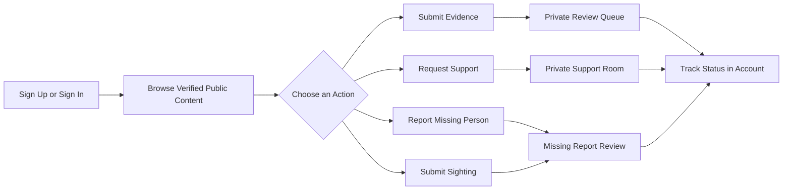
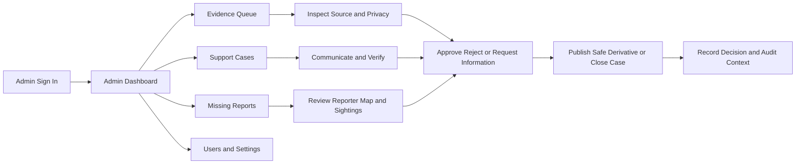
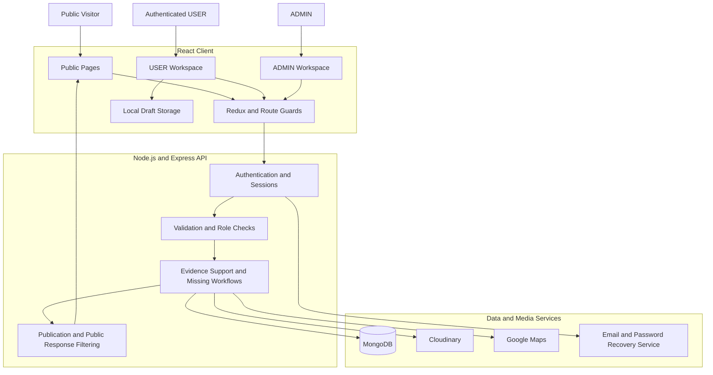

<div align="center">

# July Smriti Archive

### জুলাই স্মৃতি আর্কাইভ — স্মৃতি বাঁচুক, সত্য কথা বলুক

**Digital memory · verified evidence · private support · missing-person coordination**

A privacy-first civic archive and support platform created by **Team Astrox** to preserve the history of Bangladesh’s July 2024 movement, present source-attributed stories, protect contributors, coordinate private support, and manage verified missing-person information.


</div>

---

## Table of Contents

1. [Project Overview](#project-overview)
2. [Core Principle](#core-principle)
3. [Project Objectives](#project-objectives)
4. [User Roles](#user-roles)
5. [Main Features](#main-features)
6. [Complete Platform Flow](#complete-platform-flow)
7. [Technology Stack](#technology-stack)
8. [System Architecture](#system-architecture)
9. [Routes](#routes)
10. [API Coverage](#api-coverage)
11. [Project Structure](#project-structure)
12. [Getting Started](#getting-started)
13. [Environment Configuration](#environment-configuration)
14. [Initial Admin Access](#initial-admin-access)
15. [Privacy, Security, and Editorial Safety](#privacy-security-and-editorial-safety)
16. [Bilingual and Offline Behavior](#bilingual-and-offline-behavior)
17. [File Support and Limits](#file-support-and-limits)
18. [Testing and Validation](#testing-and-validation)
19. [Deployment](#deployment)
20. [Media and Content Guidelines](#media-and-content-guidelines)
21. [Known Boundaries](#known-boundaries)
22. [Troubleshooting](#troubleshooting)
23. [Team Astrox](#team-astrox)

---

## Project Overview

**July Smriti Archive** combines public remembrance with protected operational workflows.

The platform allows visitors to explore reviewed historical materials, stories, timeline records, public voices, and approved missing-person profiles. Registered users can submit evidence, request support, report missing people, add possible sightings, save drafts, and track the progress of their records. Administrators use a separate workspace to review private submissions, communicate with users, verify information, protect sensitive data, and publish approved public derivatives.

The project is designed around four connected responsibilities:

- **Preserve memory** through photographs, videos, audio, documents, stories, testimony, and source context.
- **Protect contributors** through anonymity, pseudonyms, publication consent, and controlled media processing.
- **Coordinate support** through private support requests, protected documents, and user/admin support rooms.
- **Help families search** through private missing-person reports, map locations, sightings, and administrator verification.

---

## Core Principle

> **Submission, verification, approval, and publication are separate stages.**

Submitting a record does not make it public.

Private originals, contributor contacts, source notes, medical files, exact sensitive locations, and unverified sightings remain protected. Public visitors receive only reviewed and approved information or a privacy-processed public derivative.

```text
Private Submission
       ↓
Administrator Review
       ↓
Verification and Privacy Processing
       ↓
Approval Decision
       ↓
Public-Safe Derivative
       ↓
Publication
```

---

## Project Objectives

- Preserve documentary records connected to the July 2024 movement.
- Present a source-attributed timeline in English and Bangla.
- Share Hero Stories, Aynaghor accounts, and Voices of July with clear editorial labels.
- Allow users to submit mixed documentary evidence in one protected workflow.
- Provide medical, medicine, rehabilitation, and legal support request workflows.
- Create private support rooms between requesters and authorized administrators.
- Allow missing-person reports and possible sightings with map information.
- Keep sensitive contacts, medical documents, and exact private locations out of public responses.
- Give users a private workspace for tracking submissions, reports, rooms, drafts, and profile settings.
- Give administrators separate review queues, decision tools, publication controls, and audit context.
- Support responsive, accessible, bilingual, and privacy-aware interaction.

---

## User Roles

### Visitor

Visitors can:

- browse the homepage and public archive;
- search and filter approved archive records;
- explore the July timeline;
- read Hero Stories and Aynaghor content;
- view Voices of July with source context and disclaimers;
- understand the support process;
- browse approved missing-person profiles;
- read the platform mission, privacy rules, and verification process.

### USER

A registered `USER` can:

- submit photos, video, audio, documents, and written testimony;
- choose anonymous, pseudonymous, or public identity presentation;
- control publication permission and privacy requests;
- create private support requests;
- communicate through private support rooms;
- upload permitted protected support documents;
- report a missing person;
- select or preview map locations;
- submit possible sightings;
- track submissions, reports, rooms, and review status;
- save and continue browser-local drafts;
- update profile and default privacy preferences.

### ADMIN

An `ADMIN` can:

- view dashboard statistics, recent activity, and queue counts;
- review private evidence submissions;
- inspect source context, media, and privacy controls;
- approve, reject, source-check, or request more information;
- manage support case priority, status, assignment, and communication;
- verify or reject specifically requested protected documents;
- review missing-person reports, reporter details, maps, and sightings;
- approve public-safe missing-person information;
- publish, unpublish, or correct archive derivatives;
- search users, inspect accounts, change roles, and remove access;
- record accountable decision notes and audit information.

---

## Main Features

### 1. Homepage and Public Experience

The homepage guides visitors from remembrance to responsible action through:

- a cinematic hero with rotating archival visuals;
- a trust strip explaining community submission, admin verification, consent, and privacy;
- archive categories and featured records;
- timeline previews;
- Hero Stories and Aynaghor previews;
- support workflow previews;
- missing-person previews;
- verification explanations;
- platform statistics;
- evidence contribution calls to action.

### 2. Verified Public Archive

The archive supports:

- free-text search across title, description, location, and tags;
- filters for photographs, videos, testimony, documents, stories, and timeline records;
- record detail pages with media, source context, attribution, tags, status, and related records;
- lazy-loaded media;
- video poster previews;
- publication of approved public derivatives only.

### 3. Timeline of July

The timeline provides:

- static source-attributed chronology;
- English and Bangla event text;
- keyword search;
- district and region filters;
- category tags;
- grouped events and locations;
- expandable sources;
- methodology notes for uncertain or differing reported information.

### 4. Hero Stories and Aynaghor

The Stories section is divided into:

- **Heroes of July** — memorial profiles of named and unnamed contributors;
- **Aynaghor, returned, and still missing** — an explainer, protected survivor or detainee accounts, family records, and unresolved truth context.

Anonymous or protected records intentionally omit names and faces where required. Allegations, survivor testimony, unresolved cases, and contested information must be labelled according to evidentiary status.

### 5. Voices of July

Voices of July presents sourced public statements and contested public records with:

- person or group context;
- role and position;
- source name and source link;
- uncertainty labels;
- disclaimers;
- correction context;
- right-of-reply framing.

The section is intended as an educational record, not a blacklist.

### 6. Evidence Contribution

The evidence form has four stages:

1. **Describe** — title, public-safe summary, testimony, and attachments.
2. **Add context** — event date, location, source type, and private source notes.
3. **Choose privacy** — anonymity, pseudonym, publication permission, archive visibility, and protection requests.
4. **Confirm** — consent, accuracy, privacy understanding, and final submission.

Supported protection requests may include:

- metadata removal;
- private name or contact redaction;
- face blurring;
- voice masking;
- administrator contact permission.

Nothing is published automatically.

### 7. Private Support Requests

Users can request:

- medical treatment;
- medicine;
- rehabilitation;
- legal support.

A request can contain urgency, approximate location, optional hospital or clinic, description, safe contact details, consent, and protected documents.

The platform clearly states that it is **not an emergency hotline**.

### 8. Support Rooms

After creating a support request, the user enters a private room shared only with authorized administrators.

The room supports:

- text messages;
- optional protected attachments;
- case status and priority;
- ordered message updates;
- unread state;
- image and document previews;
- Asia/Dhaka time presentation;
- authenticated or short-lived protected file delivery.

### 9. Missing-Person Directory and Reporting

The public directory contains administrator-approved fields only.

A private missing-person report may include:

- full name;
- optional age;
- reporter relationship;
- last-seen date and location;
- optional coordinates;
- clothing or identifying details;
- contextual description;
- private reporter contact;
- recent photo;
- publication consent;
- good-faith declaration.

Future dates are rejected.

### 10. Sightings and Map Safety

Authenticated users can submit a possible sighting with:

- date and time;
- location;
- optional map coordinates;
- contextual details;
- private contact;
- good-faith confirmation.

Future date/time combinations are rejected. Exact private coordinates and unverified sightings remain hidden until separately reviewed.

### 11. USER Workspace

The `/account` workspace contains:

- dashboard totals and quick actions;
- recent submission and support activity;
- submission status filters;
- support-room list and room details;
- missing reports and sightings;
- browser-local drafts;
- profile and default privacy settings.

### 12. ADMIN Workspace

The `/admin-panel` workspace contains:

- dashboard;
- evidence submission queue;
- support case queue;
- support case detail and messages;
- missing-person report queue;
- archive manager;
- user management;
- administrator settings.

Public browsing and private review tasks are intentionally separated.

---

## Complete Platform Flow

### USER Flow



### ADMIN Flow



---

## Technology Stack

| Layer | Technology | Responsibility |
|---|---|---|
| Frontend | React 18 | User interface and page composition |
| Routing | React Router 6 | Guest, USER, and ADMIN route separation |
| State | Redux Toolkit, React Redux | Current-user and application state |
| Styling | Tailwind CSS, reusable CSS | Responsive visual system |
| Motion | Framer Motion | Controlled page, modal, and navigation motion |
| Icons | Lucide React, React Icons | Interface iconography |
| Notifications | React Toastify and toast context | User-safe feedback |
| API Client | Native `fetch` | Credentialed requests and multipart forms |
| Backend | Node.js, Express | Authentication, validation, permissions, and workflows |
| Database | MongoDB | Users, submissions, cases, messages, reports, sightings, decisions |
| Media | Cloudinary | Uploaded media and controlled delivery |
| Maps | Google Maps JavaScript API | Search, pins, previews, and location selection |
| Translation | Local dictionary and Google Website Translator | English/Bangla experience |
| Offline Drafts | Browser `localStorage` | Local form progress without storing protected file bytes |

---

## System Architecture



The frontend router improves user experience, but it is not a security boundary. The backend remains authoritative for identity, ownership, roles, permissions, sensitive fields, and protected files.

---

## Routes

### Guest Routes

| Route | Purpose |
|---|---|
| `/login` | Sign in |
| `/sign-up` | Create a USER account |
| `/forgot-password` | Request a password-reset link |
| `/reset-password/:token` | Verify a reset token and set a new password |

### Shared/Public Routes

| Route | Purpose |
|---|---|
| `/home` | Homepage and platform overview |
| `/archive` | Search and filter approved archive records |
| `/archive/:id` | Public archive record detail |
| `/timeline` | Source-attributed July chronology |
| `/stories` | Movement summary, Hero Stories, and Aynaghor |
| `/stories/:id` | Story detail |
| `/voices` | Voices of July |
| `/support` | Support workflow explanation |
| `/missing-persons` | Approved public missing-person directory |
| `/missing-persons/:id` | Public profile and private sighting entry |
| `/about` | Mission, responsibilities, privacy, and guidelines |

### USER Routes

| Route | Purpose |
|---|---|
| `/submit` | Submit mixed documentary evidence |
| `/support/new` | Create a private support request |
| `/missing-persons/report` | Create a private missing-person report |
| `/account` | USER dashboard |
| `/account/submissions` | Track evidence submissions |
| `/account/support-rooms` | List private support rooms |
| `/account/support-rooms/:roomId` | Support room conversation |
| `/account/reports` | Track reports and sightings |
| `/account/drafts` | Continue or delete local drafts |
| `/account/profile` | Update profile and privacy preferences |

### ADMIN Routes

| Route | Purpose |
|---|---|
| `/admin-panel` | Admin dashboard |
| `/admin-panel/submissions` | Evidence review queue |
| `/admin-panel/support-cases` | Support case queue |
| `/admin-panel/support-cases/:caseId` | Protected support case detail |
| `/admin-panel/missing-reports` | Missing-person review queue |
| `/admin-panel/archive-manager` | Publish, unpublish, and correct derivatives |
| `/admin-panel/all-users` | Search and manage accounts |
| `/admin-panel/settings` | Administrator interface preferences |

---

## API Coverage

The project is organized around these API families.

| Area | Representative Operations |
|---|---|
| Authentication | signup, signin, user-details, logout, forgot-password, reset-password |
| Users | list, search, profile update, role update, access removal |
| Archive | public list/detail, admin queue, publish/unpublish |
| Submissions | create, list mine, detail, admin review |
| Support | create request, list rooms, load messages, send messages, verify documents |
| Missing Persons | public list/detail, create report, list mine, submit sightings, admin review |
| Administration | dashboard, queues, decisions, assignment, publication, audit context |

Representative endpoint paths include:

```text
/api/signup
/api/signin
/api/user-details
/api/forgot-password
/api/reset-password
/api/userLogout

/api/archive
/api/archive/:id

/api/submissions
/api/submissions/my
/api/submissions/:id

/api/support/requests
/api/support/rooms
/api/support/rooms/:roomId
/api/support/rooms/:roomId/messages

/api/missing-persons
/api/missing-persons/public/:id
/api/missing-persons/mine
/api/missing-persons/:id/sightings

/api/admin/dashboard
/api/admin/submissions
/api/admin/support-cases
/api/admin/archive
```

The exact method and payload definitions should remain synchronized with the backend route files and the frontend endpoint registry.

---

## Project Structure

```text
july-smriti-archive/
├── frontend/
│   ├── public/
│   │   └── images/                 Public-safe static and placeholder images
│   ├── src/
│   │   ├── assets/                 Project-owned local assets
│   │   ├── common/                 Endpoint registry and role helpers
│   │   ├── components/             Shared UI, maps, media, and navigation
│   │   ├── context/                Language, toast, and shared providers
│   │   ├── data/                   Timeline, stories, voices, and static content
│   │   ├── hooks/                  Online state, storage, preview, and UI hooks
│   │   ├── lib/                    API client and utilities
│   │   ├── pages/
│   │   │   ├── public/             Public website pages
│   │   │   ├── user/               USER workspace pages
│   │   │   └── admin/              ADMIN workspace pages
│   │   ├── routes/                 Router and role guards
│   │   ├── store/                  Redux store and user slice
│   │   ├── App.js                  Root layout and current-user restoration
│   │   └── index.js                Application entry point
│   ├── .env.example
│   ├── package.json
│   └── tailwind.config.js
│
├── backend/
│   ├── config/                     Database, media, CORS, and service setup
│   ├── controllers/                Request handlers and workflow decisions
│   ├── middleware/                 Authentication, role, upload, and validation
│   ├── models/                     MongoDB models and schemas
│   ├── routes/                     API route definitions
│   ├── services/                   Media, email, publication, and support logic
│   ├── utils/                      Shared backend helpers
│   ├── uploads/                    Temporary private upload staging if used
│   ├── .env.example
│   ├── package.json
│   └── server.js                   Backend entry point
│
├── documentation/
│   ├── Complete-Project-Documentation.pdf
│   └── Full-Project-Presentation.pptx
│
├── README.md
└── .gitignore
```

Folder names may differ slightly in the repository. Keep this section synchronized with the final source tree.

---

## Getting Started

### Prerequisites

Install or prepare:

- Node.js 18 LTS or newer;
- npm 9 or newer;
- MongoDB locally or a MongoDB Atlas connection;
- a Cloudinary account when uploaded media is enabled;
- a Google Maps API key for interactive map search and pin selection;
- email service configuration for password recovery;
- a modern browser supporting `fetch`, `FormData`, geolocation, object URLs, and `localStorage`.

### 1. Clone the Repository

```bash
git clone <your-repository-url>
cd july-smriti-archive
```

### 2. Install Frontend Dependencies

```bash
cd frontend
npm install
```

### 3. Configure the Frontend

Linux/macOS:

```bash
cp .env.example .env
```

Windows Command Prompt:

```bat
copy .env.example .env
```

Windows PowerShell:

```powershell
Copy-Item .env.example .env
```

### 4. Start the Frontend

```bash
npm start
```

The Create React App development server normally runs at:

```text
http://localhost:3000
```

### 5. Install Backend Dependencies

Open a second terminal:

```bash
cd backend
npm install
```

### 6. Configure the Backend

Copy the backend environment example and provide the required database, session, media, email, and origin values.

Linux/macOS:

```bash
cp .env.example .env
```

Windows Command Prompt:

```bat
copy .env.example .env
```

### 7. Start the Backend

```bash
npm run dev
```

Use the exact script defined in `backend/package.json` if the project uses a different command.

### 8. Production Build

```bash
cd frontend
npm run build
```

The optimized frontend output is written to:

```text
frontend/build/
```

### 9. Run Tests

```bash
cd frontend
npm test
```

One-run test mode:

```bash
CI=true npm test -- --watchAll=false
```

Run any backend test script defined in `backend/package.json`.

---

## Environment Configuration

### Frontend `.env`

```env
REACT_APP_BACKEND_URL=http://localhost:8080
REACT_APP_CLOUD_NAME_CLOUDINARY=
REACT_APP_GOOGLE_MAPS_API_KEY=
REACT_APP_DEMO_FALLBACK=false
```

| Variable | Purpose |
|---|---|
| `REACT_APP_BACKEND_URL` | Base URL of the authenticated API |
| `REACT_APP_CLOUD_NAME_CLOUDINARY` | Cloudinary-related client configuration when required |
| `REACT_APP_GOOGLE_MAPS_API_KEY` | Interactive map search and pin selection |
| `REACT_APP_DEMO_FALLBACK` | Optional frontend fallback; keep `false` in production |

Restart the frontend development server after changing a `REACT_APP_*` value.

### Backend `.env`

Use the exact names provided in `backend/.env.example`. The backend normally requires configuration for:

```env
# Server
PORT=8080
NODE_ENV=development
FRONTEND_URL=http://localhost:3000

# Database
MONGODB_URI=

# Authentication and sessions
SESSION_SECRET=
JWT_SECRET=

# Cloudinary or protected media service
CLOUDINARY_CLOUD_NAME=
CLOUDINARY_API_KEY=
CLOUDINARY_API_SECRET=

# Email and password recovery
EMAIL_FROM=
EMAIL_HOST=
EMAIL_PORT=
EMAIL_USER=
EMAIL_PASSWORD=
```

Do not commit real secrets to Git. If the backend uses different names, follow its `.env.example` and route/service configuration.

### Cookie and CORS Requirements

The frontend sends authenticated requests with:

```js
credentials: "include"
```

The backend must:

- allow the exact frontend origin;
- allow credentials;
- use `httpOnly` cookies for sensitive session values;
- configure `SameSite` and `Secure` correctly;
- return the authoritative current user and role from `/api/user-details`;
- reject unauthorized and cross-user requests independently of the frontend router.

---

## Initial Admin Access

> **Demo and presentation credentials only**

| Field | Value |
|---|---|
| Role | `ADMIN` |
| Email | `admin@gmail.com` |
| Password | `12345678` |

**Important:** Change or remove this password before any public or production deployment. Never keep a known demonstration password in a live system.

---

## Privacy, Security, and Editorial Safety

### Privacy Rules

1. Original evidence files are private by default.
2. Approval must publish a separate privacy-processed derivative, not the private original.
3. Contributor contacts must never appear publicly.
4. Anonymous and pseudonymous choices must be enforced on the server.
5. Metadata removal, redaction, face blur, and voice masking must occur before publication.
6. Medical documents and support conversations must never enter the public archive.
7. Unverified sightings must remain private and separately reviewed.
8. Public missing-person responses must omit reporter contact and unapproved exact coordinates.
9. Protected files should use authenticated streaming or short-lived signed URLs.
10. Sensitive administrator decisions should record actor, time, reason, and affected record.

### Security Requirements

- enforce authentication and ownership on every protected API;
- enforce `USER` and `ADMIN` roles server-side;
- rate-limit authentication, submissions, support messages, and sightings;
- validate MIME signatures, extensions, file counts, and file sizes;
- validate latitude and longitude ranges;
- reject future dates and future sighting date/time combinations;
- sanitize user-supplied text;
- use secure cookies and HTTPS;
- apply Content Security Policy rules;
- restrict Google Maps keys by allowed domain and API;
- avoid exposing internal errors or sensitive fields.

### Editorial Distinction

A source-attributed record documents what was reported or said. It does not automatically establish a court finding or prove that every member of a group agreed with every statement.

Politically and historically sensitive records should retain:

- source;
- date;
- context;
- evidentiary status;
- uncertainty;
- correction notes;
- right-of-reply information where applicable.

---

## Bilingual and Offline Behavior

### English and Bangla

The language system:

- stores `en` or `bn`;
- updates the document language;
- activates Bangla typography;
- uses local English/Bangla text pairs for core navigation and policy content;
- uses Google Website Translator for extended translation when available;
- falls back to the local dictionary when the external translator is unavailable.

### Offline Drafts

The browser can locally preserve draft progress for:

- evidence submissions;
- support requests;
- missing-person reports.

Stored locally:

- text;
- selected choices;
- privacy controls;
- document or photo names;
- location values.

Not stored locally:

- image bytes;
- video bytes;
- audio bytes;
- protected documents;
- private uploaded file contents.

Users must reselect files before final submission.

Offline drafts preserve progress only. They are not a background synchronization or conflict-resolution engine.

---

## File Support and Limits

### Evidence Submission

| Material | Supported Examples | Limit |
|---|---|---|
| Images | JPG, PNG, GIF, WEBP, AVIF, HEIC | Up to 20 total attachments |
| Video | MP4, MOV, WEBM, MKV, AVI | Up to 250 MB per file |
| Audio | MP3, WAV, M4A, OGG, AAC | Included in total request limit |
| Documents | PDF, DOC, DOCX, ODT, RTF, TXT | Duplicate detection enabled |

General evidence limits:

- up to 20 attachments;
- up to 250 MB per file;
- up to 1 GB total request size;
- duplicate detection using available file metadata.

### Support Documents

- images and PDF;
- up to 6 documents;
- up to 10 MB each.

### Missing-Person Photo

- optional recent photo;
- up to 10 MB.

Browser-side checks improve usability only. The server must perform the authoritative validation.

---

## Testing and Validation

Before release, verify:

### Build and Automated Checks

```bash
cd frontend
npm run build
npm test
```

Also run backend tests and lint scripts defined in `backend/package.json`.

### End-to-End USER Journey

- sign up and sign in;
- session restoration;
- evidence submission;
- local draft recovery;
- support request creation;
- support-room communication;
- missing-person report creation;
- map selection and fallback behavior;
- possible sighting submission;
- status tracking;
- logout.

### End-to-End ADMIN Journey

- admin sign in;
- dashboard loading;
- evidence review;
- information request, approval, and rejection;
- support case communication;
- protected document verification;
- missing-person report review;
- sighting review;
- archive publication and unpublication;
- user role management;
- logout.

### Security and Privacy Checks

- call protected APIs directly without a session;
- call USER endpoints using another user’s record ID;
- call ADMIN endpoints using a USER account;
- verify private fields never appear in public responses;
- verify private originals are not publicly accessible;
- verify signed URLs expire;
- verify future date validation;
- verify file type, count, and size validation;
- verify exact private coordinates remain hidden.

### Responsive and Accessibility Checks

- 360 px mobile layout;
- tablet and desktop layout;
- mobile navigation drawer;
- admin mobile sidebar;
- keyboard focus;
- Escape-key modal closing;
- focus-visible rings;
- descriptive alternative text;
- reduced-motion behavior;
- horizontal table scrolling;
- typing stability inside modal forms.

---

## Deployment

### Frontend

The frontend is a single-page application. Configure the host so unknown application routes return `index.html`.

Example Nginx rule:

```nginx
location / {
    try_files $uri $uri/ /index.html;
}
```

### Backend

Deploy the Node.js and Express API with:

- a production MongoDB connection;
- secure environment secrets;
- HTTPS;
- trusted proxy configuration when applicable;
- production cookie and CORS rules;
- upload and request limits;
- logging and monitoring;
- protected media delivery;
- database backups.

### Production Checklist

- set the production API URL before building;
- use HTTPS for frontend and backend;
- restrict CORS to the real frontend origin;
- configure `SameSite`, `Secure`, and `httpOnly` cookies;
- configure CSP;
- restrict Google Maps keys;
- protect Cloudinary transformations and private assets;
- disable demo fallback;
- remove placeholder statistics and private demo information;
- change the initial admin password;
- test every deep link directly;
- verify USER and ADMIN route behavior;
- verify protected APIs directly;
- monitor upload failures;
- monitor review queue age;
- monitor support response time;
- monitor unresolved missing-person reports;
- monitor publication and correction activity.

---

## Media and Content Guidelines

- Use project-owned, permissioned, public-domain, or properly licensed media.
- Do not hotlink copyrighted news photographs.
- Keep original sensitive evidence private.
- Do not place real private contacts or medical records in screenshots.
- Use fallback images so missing assets do not break the interface.
- Preserve source names, dates, links, context, and editorial notes.
- Avoid graphic injury imagery.
- Protect anonymous contributors and vulnerable families.
- Label unresolved, disputed, or partially verified material clearly.
- Keep public presentation educational and respectful rather than sensational.

Recommended screenshot naming:

```text
01-home.png
02-archive.png
03-timeline.png
04-stories.png
05-voices.png
06-evidence-form.png
07-support-request.png
08-support-room.png
09-missing-directory.png
10-missing-report.png
11-user-dashboard.png
12-admin-dashboard.png
```

---

## Known Boundaries

- Offline support preserves drafts but does not automatically upload or merge changes.
- External Google translation may be blocked by network, privacy tools, or CSP.
- Browser-stored administrator preferences are not a replacement for backend policy.
- Timeline, Stories, Aynaghor, and Voices require careful editorial maintenance.
- Demo records, images, counts, and credentials must not be presented as live verified production information.
- Privacy processing requires backend and media-service enforcement.
- Route guards improve navigation but do not replace API authorization.
- Exact endpoint names and environment variables must remain synchronized with the final backend source.

---

## Troubleshooting

### Backend Requests Fail

- confirm `REACT_APP_BACKEND_URL`;
- restart the frontend after changing `.env`;
- verify that the backend is running;
- inspect CORS and cookie settings;
- confirm that the response is valid JSON;
- inspect browser network errors and backend logs.

### Login Works but Protected Pages Return to Login

- verify `/api/user-details` receives the session cookie;
- enable credentials on frontend and backend;
- confirm the backend returns `id` or `_id`, `name`, `email`, and `role`;
- confirm the role value is `USER` or `ADMIN`;
- review `SameSite`, `Secure`, domain, and proxy settings.

### Google Map Is Not Interactive

- configure `REACT_APP_GOOGLE_MAPS_API_KEY`;
- enable the required Maps JavaScript APIs;
- restrict the key correctly;
- inspect billing, referrer, and console errors;
- use the address/coordinate preview fallback when no key is available.

### Bangla Translation Is Incomplete

- verify external translation scripts are allowed;
- check cookie and CSP restrictions;
- confirm internet access;
- expand the local dictionary for text that must work offline.

### Draft Attachments Disappear

This is expected. `localStorage` preserves form values and file names, not file bytes. Reselect attachments before submission.

### Input Accepts Only One Character at a Time

Check modal focus-management code. A form-state update must not repeatedly refocus the modal or input container. Focus should be applied only when the modal initially opens.

### Future Dates Are Accepted

Apply both client-side and server-side validation. Use today as the maximum date and validate the combined sighting date/time against the current time.

---

## Team Astrox

| Team Member | Role |
|---|---|
| **Sombit Majumdar** | Team Member |
| **Zishan Rezwan** | Team Member |
| **Takwa Jahin Feeza** | Team Member |

---

<div align="center">

### July Smriti Archive

**Preserve memory · protect people · verify before publishing**

Prepared by **Team Astrox**

</div>